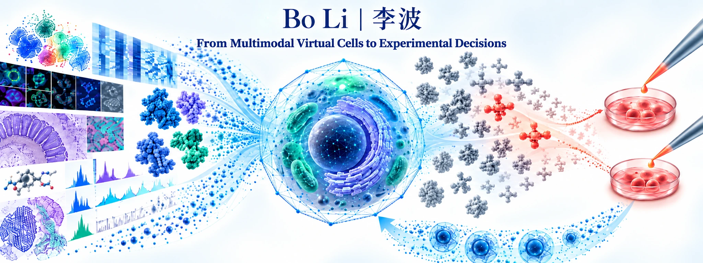

  

  
  
  
  
  

  🧬 <strong>Virtual Cells</strong> &nbsp;·&nbsp;
  🔬 <strong>Perturbation Modeling</strong> &nbsp;·&nbsp;
  💊 <strong>Intervention Design</strong> &nbsp;·&nbsp;
  🖼️ <strong>Multimodal Biology</strong>

